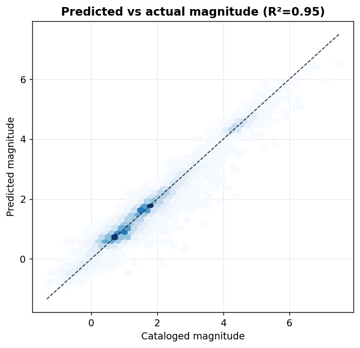
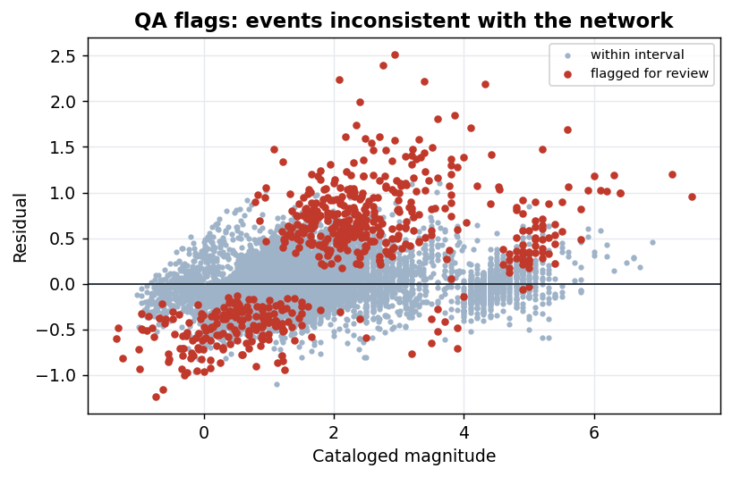
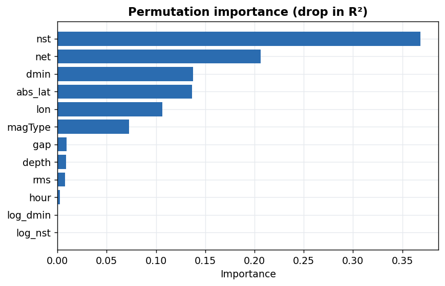
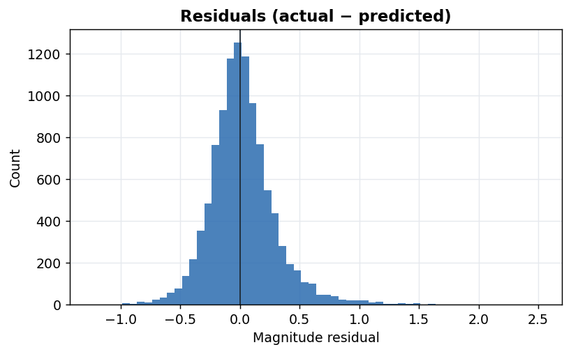

# Live Seismic ML Pipeline

**A production-style MLOps pipeline on a live scientific data stream: it ingests the USGS earthquake feed on a schedule, validates it, estimates each event's magnitude from detection-network geometry with a *calibrated prediction interval*, flags network-inconsistent events for review, and monitors its own drift — end to end, one command.**

`Python` · `scikit-learn` · `DuckDB` · `Great Expectations` · `MLflow` · `Evidently` · `conformal prediction` · `GitHub Actions (scheduled)`

> **Data:** [USGS real-time earthquake feeds](https://earthquake.usgs.gov/earthquakes/feed/v1.0/geojson.php) — public, no-auth, updated ~every minute. Real, live scientific data.

---

## What it does
```
USGS GeoJSON ─▶ ingest ─▶ validate (GX) ─▶ [train] ─▶ score (+ conformal interval) ─▶ monitor (Evidently)
   live feed     DuckDB     data gate                   QA review flags                drift + retrain signal
```
One command runs a full "tick"; a **scheduled GitHub Action** ([`.github/workflows/pipeline.yml`](.github/workflows/pipeline.yml)) runs it every 6 hours and commits refreshed reports — so the repo is genuinely *live*, not a static notebook.

## The task (and what it is *not*)
**Estimate an event's cataloged magnitude from its detection-network geometry** (`nst`, `gap`, `dmin`, `rms`, depth, location). This is a real seismology **QA task**: when the observed magnitude falls outside the model's prediction interval, the event is *inconsistent with the network that recorded it* and worth a human look.

> ⚠️ **This is not earthquake prediction.** It does not forecast future events — that is not scientifically possible from this data, and the project never claims it. It scores *already-detected* events for catalog quality control.

## Results (temporal test — train on earlier events, score later ones)
| MAE | RMSE | R² | 90% PI coverage (raw → **conformal**) |
|---|---|---|---|
| **0.27** mag | 0.38 | **0.90** | 77% → **87%** |

- **Strong signal:** network geometry explains magnitude well (R² 0.90) — physically sensible (station count, azimuthal gap, and distance relate to event size and detectability).
- **Honest uncertainty:** raw quantile intervals under-cover out-of-time (77% for a nominal 90%). **[Conformalized Quantile Regression](https://arxiv.org/abs/1905.03222)** (a distribution-free method) restores coverage to 87% by widening the band 0.93 → 1.16 mag. The residual gap to 90% is **temporal-shift-induced** — precisely what the drift monitor tracks.
- **QA output:** **5.6%** of events fall outside their conformal interval and are flagged for review — the top candidates have observed magnitudes ~2 units above what the network geometry implies.

<table>
<tr>
<td></td>
<td></td>
</tr>
<tr>
<td></td>
<td></td>
</tr>
</table>

## MLOps components (each a real, standalone stage)
| Stage | Tool | What it guarantees |
|---|---|---|
| **Ingest** | DuckDB upsert | Idempotent — re-runs never duplicate; keyed by USGS event id |
| **Validate** | Great Expectations | Physical guardrails (mag ∈ [−2,10], depth ≥ −11 km, valid coords, gap ≤ 360°); **gates** scoring on critical failures |
| **Model** | HistGBT + CQR | Magnitude point estimate + **distribution-free 90% interval** |
| **Track** | MLflow | Every training run's params/metrics → `mlruns/` |
| **Monitor** | Evidently | Feature drift, train-window vs recent (currently **6/10 features drift**) → retrain signal |
| **Schedule** | GitHub Actions | Live 6-hourly runs that commit refreshed reports |

Live snapshot: [`reports/STATUS.md`](reports/STATUS.md) (auto-updated by the scheduled job).

## Reproduce
```bash
python -m venv .venv && source .venv/bin/activate
pip install -r requirements.txt

python -m src.ingest month     # bootstrap catalog from the live feed
python -m src.train            # train + conformal-calibrate + log to MLflow
python -m src.score            # score events, flag review candidates
python -m src.monitor          # Evidently drift report
python -m src.plots            # figures

python pipeline.py --feed day --train   # or: one orchestrated live tick
mlflow ui --backend-store-uri file:./mlruns   # browse tracked runs
```

## Repo structure
```
src/  ingest · validate · features · train · score · monitor · plots · status · config
pipeline.py                  one orchestrated live tick (ingest→validate→score→monitor)
.github/workflows/pipeline.yml   scheduled 6-hourly run + report commit
reports/  model_card.md · datasheet.md · STATUS.md · figures/ · data_quality_report.md
```

## Limitations
- **Not forecasting.** Scores existing events only; says nothing about future seismicity.
- **Catalog-magnitude as ground truth** — itself an estimate; the model learns network-vs-catalog *consistency*, and "review flags" are consistency outliers, not confirmed errors.
- **~1 month of data** at bootstrap; conformal coverage assumes exchangeability, which temporal drift violates (hence the residual under-coverage and the drift monitor).
- **Single-seed temporal split**, no repeated CV; treat small metric differences as ties.

## Key docs
📋 [Model Card](reports/model_card.md) · 📄 [Datasheet](reports/datasheet.md) · 📈 [Live STATUS](reports/STATUS.md)

---
*Part of a portfolio: [Supply Chain Control Tower](https://github.com/ChinmayA301/Operations-Control-Tower) · [Healthcare Risk + Fairness](https://github.com/ChinmayA301/Risk-Prediction-with-Fairness-Geography) · [Tabular ML Benchmark](https://github.com/ChinmayA301/Tabular-ML-Benchmark-Human-Feature-Engineering-vs-AutoML-Agentic-Baselines) · this (live MLOps + scientific ML).*
